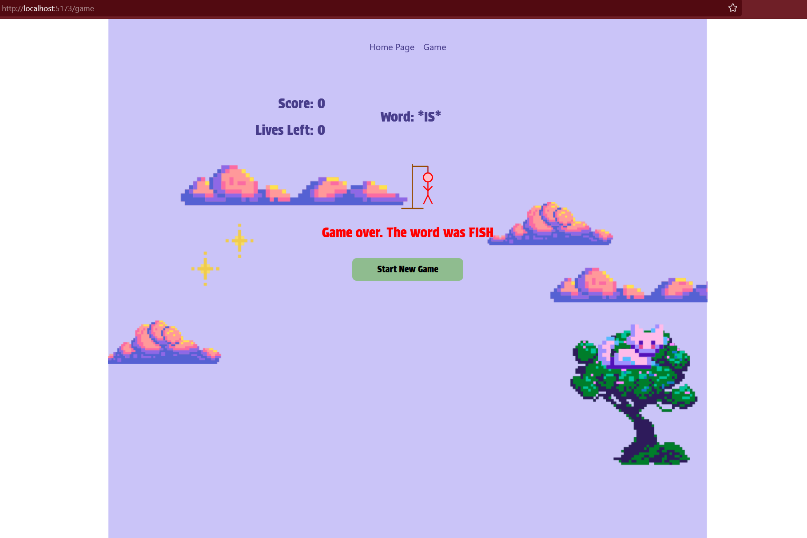

# Hangman with ReactJS and Java SpringBoot

A simple Hangman game with a backend built using Java Spring Boot and a frontend using ReactJS. Guess the word before you run out of lives. 

## How to win?
Guess the word correctly 5 times.

## Steps to Run Locally (Updating...)

### Method 1: Run Manually Without Docker (Using Batch File)
** If you have the below dependencies, simply run the run.bat file. **

#### 1. Backend (Spring Boot) 

**Prerequisites**

**Java (JDK 17 or Higher):**

 **Maven:**
https://maven.apache.org/install.html

#### 2. Frontend (React)

**Prerequisites:**

- **Node.js and npm (Node Package Manager)**  
  You'll need to install Node.js and npm to run the React frontend. You can download the latest version of Node.js from the [official website](https://nodejs.org/), which will include npm.
   - Verify the installation by running:
     `node -v`
     `npm -v`
     
**Clone the Repository into your chosen directory:**
`git clone https://github.com/nisha-toast/hangman-repository.git
cd hangman-repository`
   - Enter the frontend folder to install the dependencies:
   - `cd "(frontend) hangman react"`
   - `npm install`

**Run the Game:**
   - Once both the backend and frontend dependencies are settled, return to the root directory.
   - Double click the run.bat file in the root directory and follow the prompts
   - The game should be running on `http://localhost:5173`

## Features
- A simple Hangman game with a reactive UI built with ReactJS.
- A Spring Boot backend to manage game state and logic.

## Screenshot

  
  

## Game Play

## Suggestions for Future Work
- Add more features like word submission.
- Instead of a simple array of words, use an API to take words from elsewhere, or allow users to submit words and add to a database instead.
- Improve UI with animations or visual effects for the Hangman figure.
- Expand game functionality (e.g., multiple difficulty levels, more word categories).

